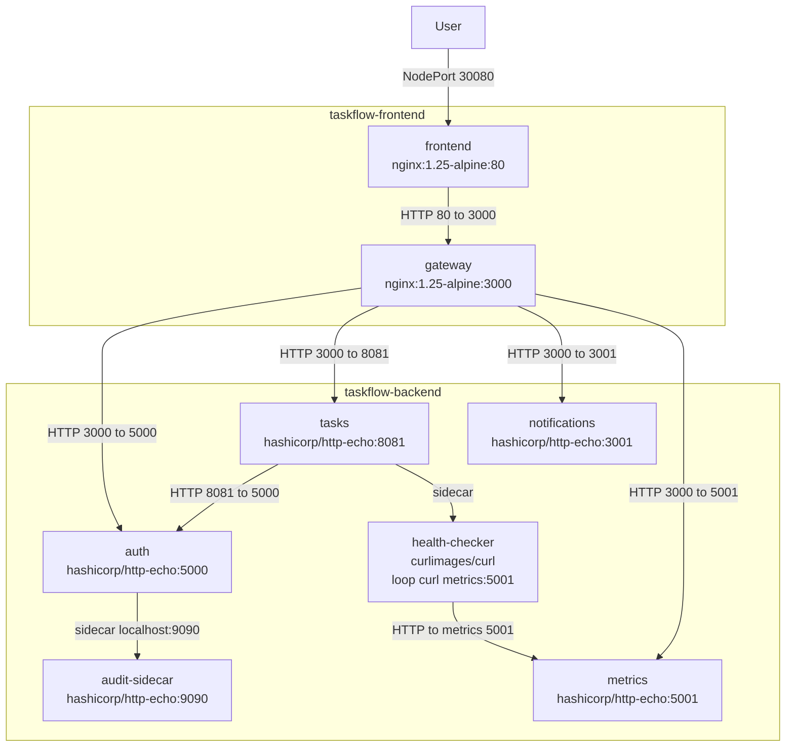

# Taskflow Kubernetes Project

This project consists of deploying **TaskFlow**, a distributed task management application designed with a **microservices architecture**. All components communicate over HTTP and are deployed on a Kubernetes cluster following best practices.

The application is composed of **six independent services** distributed across **two Kubernetes namespaces** (`taskflow-frontend` and `taskflow-backend`). This separation enables clear responsibility boundaries and enforces controlled communication between frontend and backend components.

The deployment demonstrates:
- Multi-service Kubernetes deployments using `Deployment` and `Service` resources
- Secure inter-namespace communication through explicit `NetworkPolicy` rules
- Secrets management using Kubernetes Secrets mounted as volumes
- The **sidecar pattern** to extend application behavior without modifying core containers
- The use of **init containers** to enforce startup dependencies between services
- Application health monitoring using **liveness and readiness probes**

Together, these elements illustrate a realistic, secure, and production-oriented Kubernetes architecture.

---

## Architecture Diagram

The following diagram represents the **actual implemented architecture**, based on the deployed Kubernetes manifests and validated through tests.  
All services are shown with their **container image and exposed port** (`image:port`).


---

## Deployment Instructions

The application was deployed using **Minikube** as a local Kubernetes cluster.  
All container images were **pulled and used locally**, which simplified development and testing by avoiding external registry dependencies.

This setup allows the entire project to run in a fully local environment while still reflecting real-world Kubernetes deployment practices.

### Prerequisites

- Docker
- kubectl
- Minikube (or any other equivalent solution)

### Start the Kubernetes cluster

```bash
minikube start --cni=calico
```
Or you can use at your convenience any other solution.

### Deploy the project

```bash
./deploy.sh
```
This will setup automatically all the project.

---

## Test the project

A test script is available:

```bash
./test.sh
```
As asked in the requirements, this script does all the tests asked in the validation tab.
The script performs the following checks:
  
  - **STEP 1**: Lists pods in taskflow-backend and taskflow-frontend

  - **STEP 2**: Lists services in both namespaces

  - **STEP 3**: Lists NetworkPolicies in both namespaces

  - **STEP 4**: Tests the gateway API routes through the frontend NodePort (<node-ip>:30080):
    /api/health, /api/auth, /api/tasks, /api/notifications, /api/metrics
    If using Minikube, the script automatically gets the node IP using minikube ip

  - **STEP 5**: Validates NetworkPolicies with positive and negative tests:
    Allowed paths (should work): Frontend → Gateway, Gateway → Auth, Tasks → Auth
    Denied path (should timeout): Frontend → Auth directly

  - **STEP 6**: Checks sidecar behavior (health-checker logs and accessibility checks)

  - **STEP 7**: Verifies Secrets exist and are mounted in the backend containers

If all steps succeed, the deployment and networking rules are correctly implemented.

---

## NetworkPolicies Explanation

Networking security is enforced using a **default-deny** model in the `taskflow-backend` namespace.  
All traffic is blocked by default, and only the explicitly required communication paths are allowed.

### 1) Default Deny (backend)

The policy `default-deny-all` applies to **all pods** in `taskflow-backend` and blocks **all ingress and egress** by default.

- **File:** `backend/networkpolicy-default-deny.yaml`
- **Goal:** ensure that no backend service can send/receive traffic unless it is explicitly allowed

This is the baseline security rule.

### 2) DNS Egress (backend + frontend)

Because DNS queries are required for Kubernetes service discovery (`*.svc.cluster.local`), DNS egress must be allowed.

- **Backend policy:** `allow-dns-egress` allows **UDP/TCP 53** for all backend pods
  - **File:** `backend/networkpolicy-dns.yaml`
- **Frontend policy:** `frontend-egress-only-gateway` also allows DNS (UDP/TCP 53)
  - **File:** `frontend/networkpolicy-frontend.yaml`

Without these rules, service names such as `auth-svc.taskflow-backend.svc.cluster.local` would not resolve.

### 3) Gateway → Backend (ingress allowlist)

External and frontend traffic is funneled through the API gateway.  
The policy `allow-gateway-ingress` allows **only the gateway pod** (in `taskflow-frontend`) to reach backend services on the required ports:

- **Auth:** 5000
- **Tasks:** 8081
- **Notifications:** 3001
- **Metrics:** 5001

- **File:** `backend/networkpolicy-allow-gateway.yaml`
- **Goal:** ensure that **only the gateway** can access backend services from outside the backend namespace

This prevents the frontend (or any other pod) from directly reaching backend services.

### 4) Tasks → Auth (direct service-to-service validation)

The tasks service needs to contact the auth service directly (token validation).  
This path is enabled with a pair of policies:

- `allow-tasks-egress-to-auth` (egress from tasks to auth on TCP 5000)
- `allow-auth-ingress-from-tasks` (ingress on auth from tasks on TCP 5000)

- **File:** `backend/networkpolicy-tasks-to-auth.yaml`
- **Goal:** allow **only** `tasks` → `auth` on port **5000**

### 5) Metrics Ingress (health-checker access)

The `tasks` pod contains a `health-checker` sidecar which periodically queries the `metrics` service.  
This communication is enabled by:

- `allow-tasks-egress-to-metrics` (egress from tasks to metrics on TCP 5001)
- `allow-metrics-ingress-from-tasks` (ingress on metrics from tasks on TCP 5001)

- **File:** `backend/networkpolicy-metrics-ingress.yaml`
- **Goal:** allow `tasks (health-checker)` → `metrics` on port **5001**

### Summary of Allowed Communication Paths

- `taskflow-frontend/frontend` → `taskflow-frontend/gateway` (TCP 3000)
- `taskflow-frontend/gateway` → `taskflow-backend/*` (TCP 5000, 8081, 3001, 5001)
- `taskflow-backend/tasks` → `taskflow-backend/auth` (TCP 5000)
- `taskflow-backend/tasks (health-checker)` → `taskflow-backend/metrics` (TCP 5001)
- DNS egress (UDP/TCP 53) for service discovery

All other traffic is denied by default.


