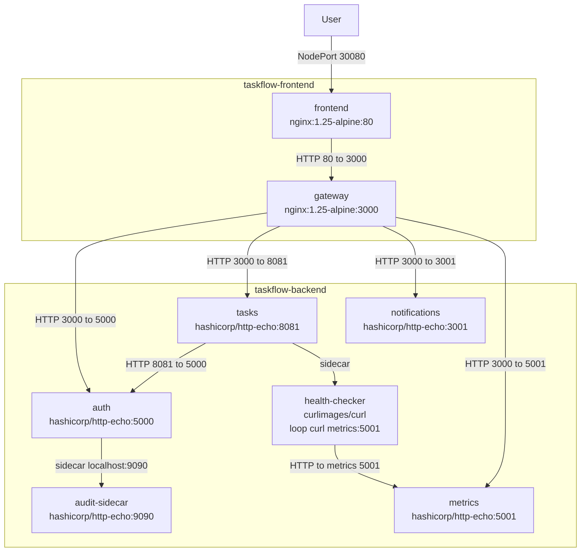

# Taskflow Kubernetes Project

This project consists of deploying **TaskFlow**, a distributed task management application designed with a **microservices architecture**. All components communicate over HTTP and are deployed on a Kubernetes cluster following best practices.

The application is composed of **six independent services** distributed across **two Kubernetes namespaces** (`taskflow-frontend` and `taskflow-backend`). This separation enables clear responsibility boundaries and enforces controlled communication between frontend and backend components.

The deployment demonstrates:
- Multi-service Kubernetes deployments using `Deployment` and `Service` resources
- Secure inter-namespace communication through explicit `NetworkPolicy` rules
- Secrets management using Kubernetes Secrets mounted as volumes
- The **sidecar pattern** to extend application behavior without modifying core containers
- The use of **init containers** to enforce startup dependencies between services
- Application health monitoring using **liveness and readiness probes**

Together, these elements illustrate a realistic, secure, and production-oriented Kubernetes architecture.

---

## Architecture Diagram

The following diagram represents the **actual implemented architecture**, based on the deployed Kubernetes manifests and validated through tests.  
All services are shown with their **container image and exposed port** (`image:port`).


---

## Deployment Instructions

The application was deployed using **Minikube** as a local Kubernetes cluster.  
All container images were **pulled and used locally**, which simplified development and testing by avoiding external registry dependencies.

This setup allows the entire project to run in a fully local environment while still reflecting real-world Kubernetes deployment practices.

### Prerequisites

- Docker
- kubectl
- Minikube (or any other equivalent solution)

### Start the Kubernetes cluster

```bash
minikube start --cni=calico
```
Or you can use at your convenience any other solution.

### Deploy the project

```bash
./deploy.sh
```
This will setup automatically all the project.

---

## Test the project

A test script is available:

```bash
./test.sh
```
As asked in the requirements, this script does all the tests asked in the validation tab.
The script performs the following checks:
  
  - **STEP 1**: Lists pods in taskflow-backend and taskflow-frontend

  - **STEP 2**: Lists services in both namespaces

  - **STEP 3**: Lists NetworkPolicies in both namespaces

  - **STEP 4**: Tests the gateway API routes through the frontend NodePort (<node-ip>:30080):
    /api/health, /api/auth, /api/tasks, /api/notifications, /api/metrics
    If using Minikube, the script automatically gets the node IP using minikube ip

  - **STEP 5**: Validates NetworkPolicies with positive and negative tests:
    Allowed paths (should work): Frontend → Gateway, Gateway → Auth, Tasks → Auth
    Denied path (should timeout): Frontend → Auth directly

  - **STEP 6**: Checks sidecar behavior (health-checker logs and accessibility checks)

  - **STEP 7**: Verifies Secrets exist and are mounted in the backend containers

If all steps succeed, the deployment and networking rules are correctly implemented.

You can also see the dashboard in your browser at <node-ip>:30080, and test services like that.

---

## NetworkPolicies Explanation

Networking security is enforced using a **default-deny** model in the `taskflow-backend` namespace.  
All traffic is blocked by default, and only the explicitly required communication paths are allowed.

### 1) Default Deny (backend)

The policy `default-deny-all` applies to **all pods** in `taskflow-backend` and blocks **all ingress and egress** by default.

- **File:** `backend/networkpolicy-default-deny.yaml`
- **Goal:** ensure that no backend service can send/receive traffic unless it is explicitly allowed

This is the baseline security rule.

### 2) DNS Egress (backend + frontend)

Because DNS queries are required for Kubernetes service discovery (`*.svc.cluster.local`), DNS egress must be allowed.

- **Backend policy:** `allow-dns-egress` allows **UDP/TCP 53** for all backend pods
  - **File:** `backend/networkpolicy-dns.yaml`
- **Frontend policy:** `frontend-egress-only-gateway` also allows DNS (UDP/TCP 53)
  - **File:** `frontend/networkpolicy-frontend.yaml`

Without these rules, service names such as `auth-svc.taskflow-backend.svc.cluster.local` would not resolve.

### 3) Gateway → Backend (ingress allowlist)

External and frontend traffic is funneled through the API gateway.  
The policy `allow-gateway-ingress` allows **only the gateway pod** (in `taskflow-frontend`) to reach backend services on the required ports:

- **Auth:** 5000
- **Tasks:** 8081
- **Notifications:** 3001
- **Metrics:** 5001

- **File:** `backend/networkpolicy-allow-gateway.yaml`
- **Goal:** ensure that **only the gateway** can access backend services from outside the backend namespace

This prevents the frontend (or any other pod) from directly reaching backend services.

### 4) Tasks → Auth (direct service-to-service validation)

The tasks service needs to contact the auth service directly (token validation).  
This path is enabled with a pair of policies:

- `allow-tasks-egress-to-auth` (egress from tasks to auth on TCP 5000)
- `allow-auth-ingress-from-tasks` (ingress on auth from tasks on TCP 5000)

- **File:** `backend/networkpolicy-tasks-to-auth.yaml`
- **Goal:** allow **only** `tasks` → `auth` on port **5000**

### 5) Metrics Ingress (health-checker access)

The `tasks` pod contains a `health-checker` sidecar which periodically queries the `metrics` service.  
This communication is enabled by:

- `allow-tasks-egress-to-metrics` (egress from tasks to metrics on TCP 5001)
- `allow-metrics-ingress-from-tasks` (ingress on metrics from tasks on TCP 5001)

- **File:** `backend/networkpolicy-metrics-ingress.yaml`
- **Goal:** allow `tasks (health-checker)` → `metrics` on port **5001**

### Summary of Allowed Communication Paths

- `taskflow-frontend/frontend` → `taskflow-frontend/gateway` (TCP 3000)
- `taskflow-frontend/gateway` → `taskflow-backend/*` (TCP 5000, 8081, 3001, 5001)
- `taskflow-backend/tasks` → `taskflow-backend/auth` (TCP 5000)
- `taskflow-backend/tasks (health-checker)` → `taskflow-backend/metrics` (TCP 5001)
- DNS egress (UDP/TCP 53) for service discovery

All other traffic is denied by default.

---

## Challenges Encountered

### 1) Deployment Order Confusion

**Issue**  
At the beginning of the project, there was uncertainty about the correct order in which Kubernetes resources should be applied.  
It was unclear whether Deployments, Services, ConfigMaps, or Secrets needed to be created first.

**Root Cause**  
While Kubernetes does not enforce a strict deployment order, some dependencies exist in practice:
- Init containers rely on **DNS resolution and existing Services**
- Pods mounting **Secrets or ConfigMaps** require them to exist before pod creation

Applying resources in the wrong order can therefore lead to pods failing to start or being stuck in initialization.

**Resolution**  
A clear and reliable deployment order was adopted and used consistently:

1. Namespaces  
2. Secrets  
3. ConfigMaps  
4. Services  
5. Deployments  
6. NetworkPolicies  

Following this order ensured that all dependencies were available when pods started, eliminating initialization and mounting issues.

### 2) Inability to Use `ls` Inside Containers

**Issue**  
During the secrets verification step, the following command failed:

```bash
kubectl exec -n taskflow-backend deploy/auth -c auth -- ls /etc/secrets
```
Result error:
```bash
OCI runtime exec failed: exec failed: unable to start container process:
exec: "ls": executable file not found in $PATH: unknown
command terminated with exit code 127
```

This initially suggested that secrets were not correctly mounted or accessible inside the container.

**Root Cause**  
The `auth` container uses the `hashicorp/http-echo` image, which is an **extremely minimal container image**.  
This image does not include common shell utilities such as:
- `ls`
- `sh`
- `cat`

As a result, any attempt to execute these commands inside the container fails, even though the container itself is running correctly.

**Resolution**  
The issue was not related to Kubernetes Secrets or volume mounts.  
Instead, it was a normal and expected behavior of minimal container images.

Secrets were validated indirectly by:
- Ensuring pods started successfully
- Verifying application behavior
- Using sidecars and HTTP-based checks instead of filesystem inspection

This highlighted an important Kubernetes concept: **minimal images increase security and reduce attack surface but limit interactive debugging inside containers**.

### 3) YAML Indentation and Structure Errors

**Issue**  
While deploying backend services, Kubernetes returned errors such as:

```bash
unknown field "spec.template.volumes"
```

or resources failed to apply without clear runtime errors.

**Root Cause**  
These errors were caused by incorrect YAML indentation and structure:
- `volumes` was defined at the wrong level in the manifest
- `volumeMounts` was not correctly nested under the container definition

Because YAML is indentation-sensitive, even a small misalignment causes Kubernetes to reject or misinterpret the manifest.

**Resolution**  
The manifests were corrected by strictly following the required Kubernetes structure, ensuring that:
- `volumeMounts` are defined **inside** each container
- `volumes` are defined at the **pod spec level**

Correct structure example:

```yaml
spec:
  containers:
  - name: app
    volumeMounts:
    - name: secrets
      mountPath: /etc/secrets
  volumes:
  - name: secrets
    secret:
      secretName: auth-secrets
```
After fixing the indentation and structure, the manifests applied correctly and pods started without errors.
This reinforced the importance of YAML precision when working with Kubernetes manifests.

### 4) Confusion Between Secret Names and Volume Names

**Issue**  
There was confusion about why the name `secrets` was used in the Deployment manifests even though no Kubernetes Secret was explicitly named `secrets`.

This raised questions such as:
- “Why am I mounting `secrets` when my Secret has a different name?”
- “Is Kubernetes creating a Secret automatically?”

**Root Cause**  
The confusion came from mixing up two different concepts:
- The **Kubernetes Secret name** (`metadata.name`)
- The **volume name**, which is an internal and arbitrary identifier

In Kubernetes:
- The volume name is freely chosen and only used to link `volumes` and `volumeMounts`
- The actual Secret referenced is defined by `secretName`

**Key Rule to Remember**

volumeMounts.name == volumes.name
secretName == metadata.name (of the Secret)

The volume name (`secrets`) is simply an internal alias and does not need to match the Secret name.

**Resolution**  
Once this distinction was clearly understood, volume and secret definitions became consistent and predictable.  
This eliminated confusion and ensured correct Secret mounting across all deployments.

### 5) ImagePullBackOff and Docker Image Pull Failures

**Issue**  
Some pods failed to start and were stuck in the `ImagePullBackOff` state with errors similar to:

```bash
dial tcp: lookup registry-1.docker.io: i/o timeout
```

This initially suggested a problem with image names, tags, or authentication.

**Root Cause**  
The Kubernetes cluster was running on **Minikube without reliable internet access**.  
As a result, the cluster could not reach Docker Hub to pull container images.

This was not related to:
- Docker credentials
- Invalid image names
- Kubernetes configuration errors

**Resolution**  
The issue was resolved by loading images **locally** into Minikube:

```bash
docker pull <image>
minikube image load <image>
```

All deployments were then configured with:
```yaml
imagePullPolicy: IfNotPresent
```
This ensured that Kubernetes reused locally available images instead of attempting to pull them from an external registry.
This solution made the deployment fully functional in an offline or restricted network environment and simplified local development.

### 6) Pods Stuck in `Init:0/1` State

**Issue**  
Some backend pods, especially `auth` and `tasks`, were stuck in the following state:

```bash
Init:0/1
```

while other services such as `metrics` and `notifications` were running normally.
This made it appear as if the Deployments were broken or misconfigured.

**Root Cause**  
The affected pods used **init containers** that waited for other services to become available using commands such as:

```bash
nslookup auth-svc.taskflow-backend.svc.cluster.local
```

Because DNS traffic was blocked by NetworkPolicies at that stage, the init containers were unable to resolve service names.  
As a result:
- The init containers never completed
- The main containers never started
- The pods remained stuck in `Init:0/1`

**Resolution**  
The issue was resolved by explicitly allowing DNS traffic through NetworkPolicies (UDP/TCP port 53).  
Once DNS egress was permitted:
- Service names resolved correctly
- Init containers completed
- Pods transitioned to the `Running` state

This highlighted how **init containers are tightly coupled to network availability and DNS resolution** in Kubernetes.

### 7) Network Issues After Restarting Minikube with Calico

**Issue**  
The cluster was working correctly at first, but after restarting Minikube with Calico enabled, multiple services suddenly stopped working.  
Pods became stuck, services were unreachable, and communication that previously worked started failing.

It initially looked like the restart “broke everything”.

**Root Cause**  
The key difference was the CNI behavior:

- **Before Calico:** the cluster networking did not enforce NetworkPolicies (they were effectively ignored)
- **After enabling Calico:** NetworkPolicies were **fully enforced**

Once Calico was active, the backend **default-deny** policy immediately started blocking:
- DNS resolution
- service-to-service traffic
- init container dependencies

This behavior was expected and revealed that the networking rules were now being applied “for real”.

**Resolution**  
The solution was to add explicit allow policies for the required traffic:
- DNS egress (UDP/TCP 53)
- Gateway → Backend ingress
- Tasks → Auth communication
- Tasks → Metrics communication

After these allow rules were in place, all services became reachable again and pods started normally.

This challenge demonstrated the real impact of using a CNI that properly enforces NetworkPolicies.

### 8) Default-Deny NetworkPolicy Appearing Ineffective

**Issue**  
Even after applying a default-deny NetworkPolicy in the backend namespace, the frontend was still able to access backend services directly.  
This gave the impression that the default-deny policy was not working.

**Root Cause**  
The default-deny NetworkPolicy was applied only to the following namespace:

`namespace: taskflow-backend`

NetworkPolicies are **namespace-scoped**.  
This means:
- The policy affected only pods inside `taskflow-backend`
- It did **not** apply to pods running in `taskflow-frontend`

As a result, frontend pods were still allowed to initiate connections to the backend unless an explicit **ingress policy** blocked them.

**Resolution**  
Ingress rules were added to the backend namespace to explicitly control which pods were allowed to reach backend services.  
Only the API gateway pod was authorized to access backend services, while all other direct access was denied.

This clarified an important Kubernetes concept: **NetworkPolicies never cross namespaces unless explicitly defined**.

### 9) Mandatory DNS NetworkPolicy

**Issue**  
Several pods were unable to start or communicate correctly, and commands such as `nslookup` failed inside init containers.  
Service discovery using Kubernetes DNS stopped working entirely.

This caused:
- Init containers to block indefinitely
- Pods to remain stuck in `Init` state
- Services to appear unreachable

**Root Cause**  
The backend namespace was protected by a **default-deny** NetworkPolicy that blocked all egress traffic by default.  
DNS resolution in Kubernetes relies on **UDP/TCP port 53**, which was therefore blocked.

Without DNS access, pods could not resolve service names such as:

`auth-svc.taskflow-backend.svc.cluster.local`

**Resolution**  
An explicit DNS egress NetworkPolicy was added to allow traffic on port **53 (UDP/TCP)** for all backend pods.

Once DNS traffic was permitted:
- Service names resolved correctly
- Init containers completed successfully
- Pods transitioned to the `Running` state

This demonstrated that **DNS access is mandatory for Kubernetes to function correctly**, especially in a default-deny networking model.

### 10) Perception of “Everything Breaking” While the Architecture Was Correct

**Issue**  
At several points during the project, it felt like the entire deployment was broken:
- Pods were stuck
- Services were unreachable
- Network communication failed unexpectedly

This created the impression that the manifests or the overall architecture were incorrect.

**Root Cause**  
In reality, the architecture and manifests were sound.  
The issues became visible because multiple strict Kubernetes features were combined:

- Calico actively enforcing NetworkPolicies
- A default-deny networking model
- Init containers depending on DNS and service availability
- Minimal container images offering limited debugging capabilities

Together, these elements made failures very explicit and sometimes abrupt, without Kubernetes providing clear, high-level error messages.

**Resolution**  
By addressing each dependency step by step (DNS, ingress rules, egress rules, init container requirements), the system became fully functional without changing the core architecture.

This final challenge highlighted an important lesson:  
**strict security configurations expose problems earlier, but they also confirm that the design is correct once everything works.**

Overall, the difficulties encountered reinforced a deep understanding of Kubernetes networking, startup flows, and real-world cluster behavior.


