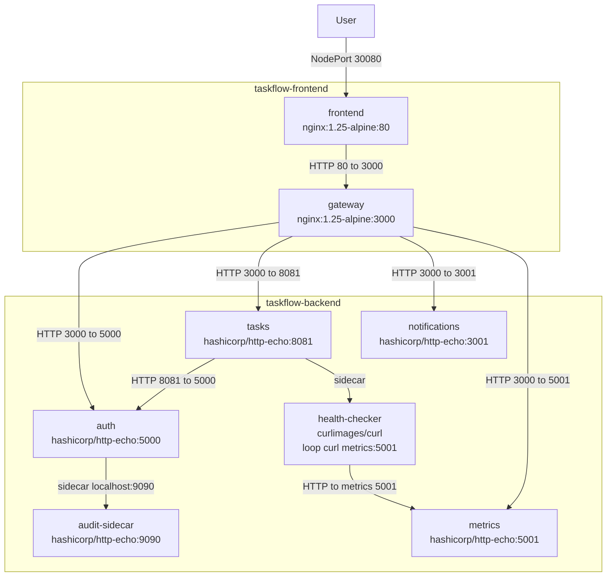

# Taskflow Kubernetes Project

This project consists of deploying **TaskFlow**, a distributed task management application designed with a **microservices architecture**. All components communicate over HTTP and are deployed on a Kubernetes cluster following best practices.

The application is composed of **six independent services** distributed across **two Kubernetes namespaces** (`taskflow-frontend` and `taskflow-backend`). This separation enables clear responsibility boundaries and enforces controlled communication between frontend and backend components.

The deployment demonstrates:
- Multi-service Kubernetes deployments using `Deployment` and `Service` resources
- Secure inter-namespace communication through explicit `NetworkPolicy` rules
- Secrets management using Kubernetes Secrets mounted as volumes
- The **sidecar pattern** to extend application behavior without modifying core containers
- The use of **init containers** to enforce startup dependencies between services
- Application health monitoring using **liveness and readiness probes**

Together, these elements illustrate a realistic, secure, and production-oriented Kubernetes architecture.

---

## Architecture Diagram

The following diagram represents the **actual implemented architecture**, based on the deployed Kubernetes manifests and validated through tests.  
All services are shown with their **container image and exposed port** (`image:port`).


---

## Deployment Instructions

The application was deployed using **Minikube** as a local Kubernetes cluster.  
All container images were **pulled and used locally**, which simplified development and testing by avoiding external registry dependencies.

This setup allows the entire project to run in a fully local environment while still reflecting real-world Kubernetes deployment practices.

### Prerequisites

- Docker
- kubectl
- Minikube (or any other equivalent solution)

### Start the Kubernetes cluster

```bash
minikube start --cni=calico

Or you can use at your convenience any other solution.

### Deploy the project

```bash
./deploy.sh

This will setup automatically all the project.

## Test the project

A test script is available:

```bash
./test.sh

As asked in the requirements, this script does all the tests asked in the validation tab.


